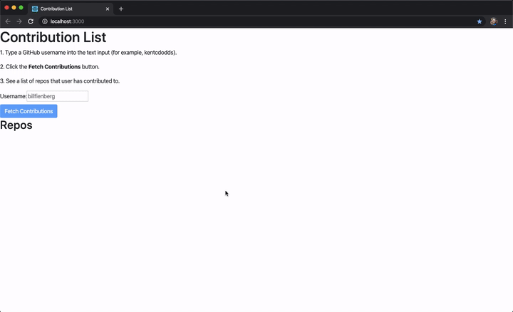

# Realistic React Refactoring

## Table of Contents

- [Motivation](#motivation)
  * [The App](#the-app)
    + [Problem](#problem)
    + [Solution](#solution)
      * [Screenshot of finished app](#screenshot-of-finished-app)
  * [Agenda](#agenda)

## Motivation

I strongly agree with Kent Beck's recommendation of first making the change easy, and then making the easy change.

<blockquote class="twitter-tweet">
for each desired change, make the change easy (warning: this may be hard), then make the easy change
&mdash; Kent Beck (@KentBeck) <a href="https://twitter.com/KentBeck/status/250733358307500032?ref_src=twsrc%5Etfw">September 25, 2012</a></blockquote>

I also strongly agree with Kent C. Dodd's thoughts about testing implementation details.

<blockquote class="twitter-tweet">
Testing implementation details is a recipe for disaster.  Do yourself a favor and give react-testing-library a solid try. Your future self will thank your present self <a href="https://t.co/iMU4gcj8aP">https://t.co/iMU4gcj8aP</a> 🐐
&mdash; Kent C. Dodds 🧑‍🚀 (@kentcdodds) <a href="https://twitter.com/kentcdodds/status/1037855652985495552?ref_src=twsrc%5Etfw">September 7, 2018</a></blockquote>

Additionally, I try to make my code resemble documentation code as much as possible. However, documentation code is often updated and refactored much faster and more frequently than production code.

I hope this series of branches demonstrates my attempts to get an app working, add tests, and then incrementally improve the app without having to significantly change my tests.

### The App

I don't want to build a cliche app, like a todo list. And I'd prefer if my app actually solves a real problem and/or answers a real question(s) I've had for a while.

#### Problem

As a developer who has fixed a handful of typos and grammatical errors in open source documentation, I want to see a list of all the repos that I've "contributed" to, along with how many stars all those repos have, so I can "measure" the reach of my impact.

#### Solution

I will build an app with the following features:

- A text input where the user can type a GitHub username
- A button that queries the GitHub GraphQL service for the [`repositoriescontributedto`](https://developer.github.com/v4/object/user/#repositoriescontributedto) for the specified user
- A table of repos showing repo owner, name, and stargazers

##### Screenshot of finished app

### Agenda

1. Configuration
   - Prettier
   - Format script
1. Get it working with no dependencies
   - Regular HTML and native `fetch`
1. Add tests
   - Testing library
1. Separate data and UI
   - Extract presentational components
1. Reskin UI
   - Replace regular HTML with Bootstrap
1. Update API client
   - Replace native `fetch` with Apollo Client
1. Refactor
   - Replace class components with hooks
